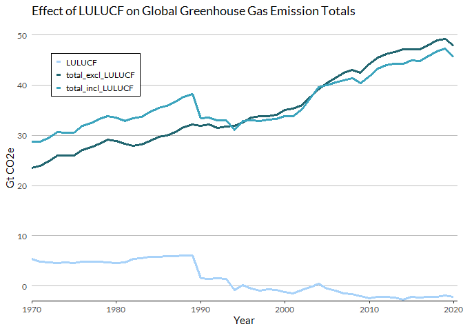
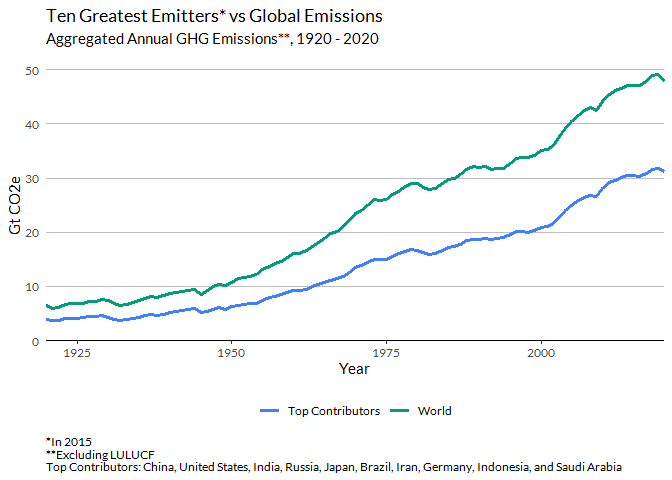

Missed Benchmarks: Predicting the 2030 Emissions Gap
================
Elizabeth Walter

``` r
library(tidyverse)
library(tidyr)
library(dplyr)
library(readxl)
library(extrafont)
extrafont::loadfonts(device="win")
library(ggrepel)
library(ggplot2)
library(countrycode)
library(RColorBrewer)
library(naniar)
library(paletteer)
library(skimr)
library(showtext)
#showtext_auto()
```

``` r
# Link to Data: https://zenodo.org/records/10006301#use-of-the-dataset-and-full-description
# load data and convert to tidy

co2_raw <- read_csv("Guetschow_et_al_2023b-PRIMAP-hist_v2.5_final_no_extrap_no_rounding.csv", 
                    col_names = c("source", "scenario", 'provenance', 'ISO3', 'entity', 
                                  "unit", "category", c(1750:2022)), skip = 1) %>%
  filter(scenario == "HISTCR",
         entity == "KYOTOGHG (AR6GWP100)",
         category == "0" | category == "M.0.EL" | category == "M.LULUCF") %>%
  mutate(country = countrycode(ISO3, origin = "iso3c", destination = "country.name", 
                               custom_match = c("ANT" = "Netherlands Antilles"))) %>%
  gather(year, GgCO2e, "1750":"2022") %>%
  mutate(year = as.numeric(year), GtCO2e = GgCO2e/1000000) %>%
  select(ISO3, country, year, category, GtCO2e) %>%
  spread(category, GtCO2e) %>%
  rename(total_incl_LULUCF = "0", total_excl_LULUCF = "M.0.EL", LULUCF = "M.LULUCF") %>%
  mutate(LULUCF = replace_na(LULUCF, 0), 
         total_incl_LULUCF = replace_na(total_incl_LULUCF,0),
         total_excl_LULUCF = replace_na(total_excl_LULUCF,0)) #all NA LULUCF data has been changed to 0

co2_1850 <- co2_raw %>% filter(between(year, 1850, 2020)) 
co2_1850 <- subset(co2_1850, select = -c(ISO3))
```

``` r
# get total (worldwide) emissions for each year
world <- co2_1850 %>% 
  group_by(year) %>%
  summarize(country = "World",
    total_excl_LULUCF = sum(total_excl_LULUCF, na.rm = TRUE), 
    total_incl_LULUCF = sum(total_incl_LULUCF,  na.rm = TRUE),
    LULUCF = sum(LULUCF, na.rm = TRUE))
```

``` r
# append world to co2_raw as new df
co2_1850_w_world <- dplyr::union(co2_1850, world)
```

``` r
# explore effects of LULUCF on global total and whether to include
# so the unfccc ndcs do not include LULUCF? which ones? all of them?

global_totals_vs_lulucf <- world %>%
  pivot_longer(total_excl_LULUCF:total_incl_LULUCF:LULUCF, names_to = "category", values_to = "GtCO2e") 

global_totals_vs_lulucf <- global_totals_vs_lulucf %>%
  ggplot(aes(year, GtCO2e, color = category), linewidth = 1) +
  geom_line(aes(year, GtCO2e), linewidth = .9) + #aes(year, GtCO2e), linewidth = 1.5
  geom_hline(yintercept = 0, linewidth = .5) +
  coord_cartesian(xlim = c(1970, 2021), expand = FALSE) +
  scale_y_continuous(limits = c(-3, 50)) +
  labs(x= "Year", color = element_blank()) +
  theme_classic() +
  theme(legend.position = c(0.15, 0.85), 
        legend.key.size = unit(0.2, "cm"), 
        legend.key.spacing.y = unit(.2, "cm"),
        legend.background = element_rect(fill = "white", color = 1), 
        legend.title = element_blank(), 
        text = element_text(family = "Lato"))


# graphing the global observations of total_incl_LULUCF, total_excl_LULUCF, and LULUCF over time

global_totals_vs_lulucf + scale_color_manual(values = c("#A8D2F9FF","#226670", "#3CA4BD"))
```



``` r
                                               #c("#009E68", "#03650e", "#1dd215"))
```

``` r
# explore greatest emitters by cumulative total across all time NOT INCLUDING LULUCF

#The following table shows the first 10 countries and their cumulative totals in descending order for all countries from 1850 to 2020.

co2_country_cumulative <- co2_1850 %>%
  group_by(country) %>%
  summarize(sum_total_incl_LULUCF = sum(total_incl_LULUCF),
            sum_total_excl_LULUCF = sum(total_excl_LULUCF),
            sum_LULUCF = sum(LULUCF)) %>%
  arrange(desc(sum_total_excl_LULUCF))
print(head(co2_country_cumulative, 10))
```

    ## # A tibble: 10 × 4
    ##    country        sum_total_incl_LULUCF sum_total_excl_LULUCF sum_LULUCF
    ##    <chr>                          <dbl>                 <dbl>      <dbl>
    ##  1 United States                  592.                  557.      35.3  
    ##  2 China                          426.                  364.      62.1  
    ##  3 Russia                         187.                  176.      11.0  
    ##  4 India                          150.                  119.      30.5  
    ##  5 Germany                        115.                  115.      -0.813
    ##  6 United Kingdom                 103.                   99.2      3.31 
    ##  7 Japan                           75.4                  76.4     -0.981
    ##  8 France                          56.5                  59.7     -3.21 
    ##  9 Ukraine                         57.3                  51.5      5.79 
    ## 10 Brazil                         130.                   49.0     81.2

``` r
co2_cumulative_10_list <- head(co2_country_cumulative$country,10) # - this is a list of the top 10 by cumulative amount as of 2020, as derived above.

# make new data sets - one that is just those top ten from above, 1 of all the others
df_top_10_subsect <- filter(co2_1850, (country %in% co2_cumulative_10_list))
df_all_others <- filter(co2_1850, !(country %in% co2_cumulative_10_list))
```

``` r
# make a stacked area graph of the top 10 & all others over time
    # decide view/window - start w what year on GRAPH

# made df where all of the other countries had their values added together for each year and the name of
    # the country representing those yearly totals is called "Other"
  # so its been condensed down to 1 row per year

df_others_sum <- df_all_others %>%
  replace_with_na_if(.predicate =is.character,
                     condition = ~.x %in% (df_all_others$country)) %>%
  mutate(country = replace_na(country, "All Others")) %>%
  group_by(year) %>%
  summarize(total_incl_LULUCF = sum(total_incl_LULUCF),
            total_excl_LULUCF = sum(total_excl_LULUCF),
            LULUCF = sum(LULUCF)) %>%
  cbind(., country = c("All Others")) %>%
  relocate(country)
```

``` r
# adding the country "other" to the top 10 subset data set
dfs_combined <- union(df_top_10_subsect, df_others_sum)
```

``` r
# the cumulative of the sum of all OTHER countries from 1850 - 2020
# Why do I need this ? Bc I need to order my graph from biggest area on top to 
#   smallest on bottom and this is what ive figured out

all_others_summed_cumulative <- df_all_others %>%
  group_by(country) %>%
  mutate(cumsum_total_incl_LULUCF = cumsum(total_incl_LULUCF),
            cumsum_total_excl_LULUCF = cumsum(total_excl_LULUCF),
            cumsum_LULUCF = cumsum(LULUCF)) %>%
  group_by(year) %>%
  summarize(country = "All Others",
            cumsum_total_excl_LULUCF = sum(cumsum_total_incl_LULUCF))

df_10_cumu <- df_top_10_subsect %>%
  group_by(country) %>%
  mutate(cumsum_total_incl_LULUCF = cumsum(total_incl_LULUCF),
         cumsum_total_excl_LULUCF = cumsum(total_excl_LULUCF),
         cumsum_LULUCF = cumsum(LULUCF)) %>%
  select(country, year, cumsum_total_excl_LULUCF) %>%
  arrange(desc(year), desc(cumsum_total_excl_LULUCF))


all_together_cumulative <- union(df_10_cumu, all_others_summed_cumulative)
```

``` r
# plot of the top ten countries and the one named other over time

# Code on next line from https://stackoverflow.com/questions/72068140/set-order-of-stacked-area-graphs-by-sales-in-ggplot-r Plot order
ls <- all_together_cumulative %>% filter(year == 2020)  %>% arrange(desc(cumsum_total_excl_LULUCF)) %>% select(country)

#DIY PALETTES
mypalette <- c("#3CA4BD",  "#03652e", "#BED4F9FF", "#009E78", "#3F80FF", '#1dd212', "#ccfd80", "#073F80",  "#ACE8F2", "#466830",  "#1dd280", "#466870")

mypalette2 <- c( "#3F80FF", "#073F80", "#A8D2F9FF", "#BED1F9FF","#009E78","#03652e", "#3CA4BD", "#ACE8F2", "#1dd280", "#466830",  "#466870", '#1dd212', "#ccfd10",  "#226670")

mypalette3 <- c( "#8fdc11", "#ccfd10", "#3F80FF", "#073F80", "#A8D2F9FF", "#BED1F9FF","#009E78", "#03652e", "#3CA4BD", "#ACE8F2", "#466830",  "#466870")
```

``` r
plot_dfs_combined <- dfs_combined %>%
  mutate(country = factor(country, levels = ls$country)) %>% 
  ggplot(aes(year, total_excl_LULUCF, fill = country)) +
  geom_area() +
  coord_cartesian(xlim = c(1950,2020), expand = FALSE) +
  theme_classic() +
  scale_fill_manual(values = mypalette) +
#  scale_fill_paletteer_d("palettetown::snubbull") +
#  scale_fill_paletteer_d("palettetown::mr_mime") +
#  scale_fill_paletteer_d("ggthemes::Green_Orange_Teal") +
#  scale_fill_paletteer_d("IslamicArt::samarqand") +
#  scale_fill_paletteer_d("ggprism::floral2") + 
#  scale_fill_paletteer_d("ggthemes::hc_fg") + 
  theme(text = element_text(family = "Lato"),
        plot.title = element_text(hjust = 0.5),
        plot.subtitle = element_text(hjust = 0.5),
        panel.grid.major.y = element_line(color = "grey"),
        plot.caption = element_text(hjust = 0)) +
  labs(x = "Year",
       y = "Gt CO2e",
       subtitle = "Yearly GHG Emissions**, 1950 - 2020",
       title = "Ten Greatest Emitters, Cumulatively* & All Others",
       caption = "*Rankings as of 2020
**Excluding LULUCF",
       fill = "Country")

plot_dfs_combined
```


``` r
# Countries sorted by who emitted the most in the year 2015

co2_1850_2015 <- co2_1850 %>%
  filter(year == 2015) %>%
  arrange(desc(total_excl_LULUCF)) 

# list of top 10 countries
top_10_2015_list <- head(co2_1850_2015$country, 10)
  
# smaller dataset with just the info of those 10 countries
df_top_10_2015 <- co2_1850 %>%
  filter(country %in% top_10_2015_list)

# need it to include "World"
df_top_10_n_world_2015 <- union(df_top_10_2015, world)

# data frame of total from aggregated top 10 each year 1850 - 2020
df_agg_top_10 <- df_top_10_2015 %>%
  select(year, total_incl_LULUCF, total_excl_LULUCF, LULUCF) %>%
  group_by(year) %>%
  summarize(total_incl_LULUCF = sum(total_incl_LULUCF),
            total_excl_LULUCF = sum(total_excl_LULUCF),
            LULUCF = sum(LULUCF)) %>%
  mutate(country = "Aggregated 10")

# appending "World"
df_agg_top_10_n_world_2015 <- union(df_agg_top_10, world) 
```

``` r
# plot before aggregating
plot_world_over_time <- world %>%
  ggplot(aes(year, total_excl_LULUCF)) +
  geom_line() +
  theme_bw() +
  coord_cartesian(xlim = c(1850, 2021), ylim = c(0,50), expand = FALSE) +
  theme(text = element_text(family = "Lato"),
                plot.title = element_text(hjust = 0.5)) +
  labs(x = "Year", y = "Gt CO2e", title = "Global Emissions Over Time")
print(plot_world_over_time)
```


``` r
# import INDC/NDC data
Country_Pledges <- read_excel("Country_Pledges.xlsx",
                              col_types = c("text", "numeric", "numeric", 
                                            "text", "numeric", "numeric", 
                                            "numeric", "numeric", "numeric"))
```

``` r
# INDC/NDC data
pre_2020 <- Country_Pledges %>%
  filter(TargetCategory == "Pre-2020") %>%
  arrange(Year)

indcs <- Country_Pledges %>%
  filter(TargetCategory == "INDC") %>%
  arrange(Year)

ndcs <- Country_Pledges %>%
  filter(TargetCategory == "NDC") %>%
  arrange(Year)
```

``` r
target_pre2020 <- Country_Pledges %>%
  filter(Year == 2020  & TargetCategory == "Pre-2020") %>%
  distinct(Country, ReductionDec, .keep_all = TRUE) 

target_indc2030 <- Country_Pledges %>%
  filter(Year == 2030 & TargetCategory == "INDC") %>%
  distinct(Country, ReductionDec, .keep_all = TRUE)

target_ndc2030 <- Country_Pledges %>%
  filter(Year == 2030 & TargetCategory == "NDC") %>%
  distinct(Country, ReductionDec, .keep_all = TRUE)

sum_emissions_2015 <- sum(df_top_10_2015$total_excl_LULUCF[df_top_10_2015$year == 2015])
```

``` r
sum_target_start_indc <- data.frame(Year = 2015,
                TargetCategory = "Start",
                sum_reduction_dec = 0,
                sum_reduction_amt = 0,
                sum_result = sum(df_top_10_2015$total_excl_LULUCF[df_top_10_2015$year == 2015]))

sum_target_start_ndc <- data.frame(Year = 2016,
                                    TargetCategory = "Start",
                                    sum_reduction_dec = 0,
                                    sum_reduction_amt = 0,
                                    sum_result = sum(df_top_10_2015$total_excl_LULUCF[df_top_10_2015$year == 2016]))                

sum_target_pre2020<- target_pre2020 %>%
  summarize(Year = 2020,
            TargetCategory = "Pre-2020",
            sum_reduction_dec = sum(ReductionDec),
            sum_reduction_amt = sum(ReductionAmount),
            sum_result = sum(Result))

sum_target_indc2030<- target_indc2030 %>%
  summarize(Year = 2030,
            TargetCategory = "INDC",
            sum_reduction_dec = sum(ReductionDec),
            sum_reduction_amt = sum(ReductionAmount),
            sum_result = sum(Result)) 

sum_target_ndc2030<- target_ndc2030 %>%
  group_by(Year) %>%
  summarize(Year = 2030,
            TargetCategory = "NDC",
            sum_reduction_dec = sum(ReductionDec),
            sum_reduction_amt = sum(ReductionAmount),
            sum_result = sum(Result))

df_targets_nondc <- rbind(sum_target_start_indc, sum_target_pre2020, sum_target_indc2030)
df_targets_noindc <- rbind(sum_target_start_ndc, sum_target_pre2020, sum_target_ndc2030)
```

``` r
#graph INDCs

indc_line <- df_targets_nondc %>%
  select(Year, sum_result) %>%
  rename(year = Year,
         total_excl_LULUCF = sum_result) %>%
  mutate(country = "INDC")

# graph NDCs

ndc_line <- df_targets_noindc %>%
  select(Year, sum_result) %>%
  rename(year = Year,
         total_excl_LULUCF = sum_result) %>%
  mutate(country = "NDC")
```

``` r
# import and subset pathways

pathways <- read_excel("Global Emission Pathways.xlsx", 
                       col_types = c("text", "text", "numeric", 
                                     "numeric", "text", "numeric", "numeric", 
                                     "numeric", "numeric", "numeric"))
  
path_1pt5 <- pathways %>%
  filter(Pathway == "1.5",
         TargetCategory %in% c("Start", "NDC")) %>%
  select(Country, Pathway, TargetCategory, Year, Result)

path_1pt5 <- path_1pt5 %>%
  mutate(country = Country, year = Year, total_excl_LULUCF = Result)

path_2 <- pathways %>%
  filter(Pathway == "2",
         TargetCategory %in% c("Start", "NDC")) %>%
  select(Country, Pathway, TargetCategory, Year, Result) 

path_2 <- path_2 %>%
  mutate(country = Country, year = Year, total_excl_LULUCF = Result)
```

``` r
# create BAU/2015 prediction lines - World
world_total_1985_2015 <- world %>%
  filter(year %in% (1990:2015)) %>%
  select(year, total_excl_LULUCF)

# creating a data frame of predicting years
bau_years <- data.frame(year = c(2016, 2017, 2018, 2019, 2020, 
                                 2021, 2022, 2023, 2024, 2025, 
                                 2026, 2027, 2028, 2029, 2030))

# creating a linear model to predict world BAU
bau_world_linmodel <- lm(total_excl_LULUCF ~ year, data = world_total_1985_2015)
summary(bau_world_linmodel)
```

    ## 
    ## Call:
    ## lm(formula = total_excl_LULUCF ~ year, data = world_total_1985_2015)
    ## 
    ## Residuals:
    ##      Min       1Q   Median       3Q      Max 
    ## -1.97980 -0.58871  0.06008  0.70665  2.56517 
    ## 
    ## Coefficients:
    ##               Estimate Std. Error t value Pr(>|t|)    
    ## (Intercept) -1.405e+03  6.096e+01  -23.05   <2e-16 ***
    ## year         7.208e-01  3.044e-02   23.68   <2e-16 ***
    ## ---
    ## Signif. codes:  0 '***' 0.001 '**' 0.01 '*' 0.05 '.' 0.1 ' ' 1
    ## 
    ## Residual standard error: 1.164 on 24 degrees of freedom
    ## Multiple R-squared:  0.959,  Adjusted R-squared:  0.9572 
    ## F-statistic: 560.7 on 1 and 24 DF,  p-value: < 2.2e-16

``` r
## (Intercept)         year 
## -481.7933130    0.2566006 

bau_world_predict <- predict(bau_world_linmodel, newdata = bau_years)
bau_world_predict
```

    ##        1        2        3        4        5        6        7        8 
    ## 48.04695 48.76780 49.48865 50.20950 50.93035 51.65120 52.37205 53.09290 
    ##        9       10       11       12       13       14       15 
    ## 53.81375 54.53460 55.25545 55.97631 56.69716 57.41801 58.13886

``` r
# create predictions - top ten
agg10_total_1985_2015 <- df_agg_top_10 %>%
  filter(year %in% (1990:2015)) %>%
  select(year, total_excl_LULUCF)

# creating a linear model to predict world BAU
bau_agg10_linmodel <- lm(total_excl_LULUCF ~ year, data = agg10_total_1985_2015)
summary(bau_agg10_linmodel)
```

    ## 
    ## Call:
    ## lm(formula = total_excl_LULUCF ~ year, data = agg10_total_1985_2015)
    ## 
    ## Residuals:
    ##      Min       1Q   Median       3Q      Max 
    ## -1.71335 -0.44969  0.08783  0.61122  1.91719 
    ## 
    ## Coefficients:
    ##               Estimate Std. Error t value Pr(>|t|)    
    ## (Intercept) -1.069e+03  5.031e+01  -21.25   <2e-16 ***
    ## year         5.456e-01  2.512e-02   21.71   <2e-16 ***
    ## ---
    ## Signif. codes:  0 '***' 0.001 '**' 0.01 '*' 0.05 '.' 0.1 ' ' 1
    ## 
    ## Residual standard error: 0.9608 on 24 degrees of freedom
    ## Multiple R-squared:  0.9516, Adjusted R-squared:  0.9495 
    ## F-statistic: 471.5 on 1 and 24 DF,  p-value: < 2.2e-16

``` r
## (Intercept)         year 
## -481.7933130    0.2566006 

bau_agg10_predict <- predict(bau_agg10_linmodel, newdata = bau_years)
```

``` r
#evaluate fit
world_1990_2015 <- world %>% filter(year %in% (1990:2015))

plot(world_1990_2015$year, world_1990_2015$total_excl_LULUCF)
r<- lm(total_excl_LULUCF~year, data=world_1990_2015)
abline(r)
```


``` r
#graph BAU/2015 predictions - World
bau_df <- data.frame(year = c(2016, 2017, 2018, 2019, 2020, 
                              2021, 2022, 2023, 2024, 2025, 
                              2026, 2027, 2028, 2029, 2030),
                     total_excl_LULUCF = bau_world_predict,
                     country = "World",
                     total_incl_LULUCF = NA, 
                     LULUCF = NA)

#graph BAU/2015 predictions - top ten
bau_agg10_df <- data.frame(year = c(2016, 2017, 2018, 2019, 2020, 
                                    2021, 2022, 2023, 2024, 2025, 
                                    2026, 2027, 2028, 2029, 2030),
                           total_excl_LULUCF = bau_agg10_predict,
                           country = "Aggregated 10",
                           total_incl_LULUCF = NA, 
                           LULUCF = NA)
  
bau_df <- union(bau_df, bau_agg10_df)

world_2015_total <- world %>% filter(year == 2015)
agg10_2015_total <- df_agg_top_10 %>% filter(year == 2015)

bau_df_2 <- rbind(bau_df, world_2015_total, agg10_2015_total)

bau_df_2$country <- with(bau_df_2, factor(country, levels = c("World", "Aggregated 10"), labels = c("World_Pred", "Aggregated 10_Pred")))
```

``` r
# simple linear regression to create predicted values from 2021 - 2030
# using values from 2015 - 2020

df_agg_world_short <- world %>% 
  filter(year %in% (2015:2020)) %>%
  select(year, total_excl_LULUCF, country)
  
bau_years_2 <- data.frame(year = c(2020, 2021, 2022, 2023, 2024, 2025, 
                                 2026, 2027, 2028, 2029, 2030))

pred_world_linmodel <- lm(total_excl_LULUCF ~ year, data = df_agg_world_short)
#summary(pred_world_linmodel)

pred_world <- predict(pred_world_linmodel, newdata = bau_years_2)
pred_world
```

    ##        1        2        3        4        5        6        7        8 
    ## 48.73327 49.02113 49.30900 49.59687 49.88474 50.17260 50.46047 50.74834 
    ##        9       10       11 
    ## 51.03621 51.32407 51.61194

``` r
df_agg_top_10_short <- df_agg_top_10 %>% 
  filter(year %in% (2015:2020)) %>%
  select(year, total_excl_LULUCF, country)

pred_agg10_linmodel <- lm(total_excl_LULUCF ~ year, data = df_agg_top_10_short)

pred_agg10 <- predict(pred_agg10_linmodel, newdata = bau_years_2)


pred_df <- data.frame(year = c(2020, 2021, 2022, 2023, 2024, 2025, 
                               2026, 2027, 2028, 2029, 2030),
                      total_excl_LULUCF = pred_world,
                      country = "World",
                      total_incl_LULUCF = NA,
                      LULUCF = NA)

pred_10_df <- data.frame(year = c(2020, 2021, 2022, 2023, 2024, 2025, 
                                  2026, 2027, 2028, 2029, 2030),
                         total_excl_LULUCF = pred_agg10,
                         country = "Aggregated 10", # i need to be able to append this 
                         total_incl_LULUCF = NA, # to the bottom of df_agg_top_10_n_world_1015
                         LULUCF = NA)

pred_df <- union(pred_df, pred_10_df)

df_agg10_world_2015_2030 <- union(df_agg_top_10_n_world_2015, pred_df)

df_agg10_world_2020_2030 <- df_agg10_world_2015_2030 %>%
  filter(year %in% (2020:2030))

df_agg10_world_2020_2030$country <- with(df_agg10_world_2020_2030, factor(country, levels = c("World", "Aggregated 10"), labels = c("World_Pred", "Aggregated 10_Pred")))
```

``` r
# stuff for plot in following chunk
y_start_agg10 <- ndc_line %>%
  filter(year == 2030) %>%
  select(total_excl_LULUCF)
#as.integer(y_start_agg10)
y_start_agg10 <- y_start_agg10$total_excl_LULUCF

bau_yend_agg10 <- bau_df_2 %>%
  filter(year == 2030 & country == "Aggregated 10_Pred") %>%
  select(total_excl_LULUCF)
#as.integer(bau_yend_agg10)
bau_yend_agg10 <- bau_yend_agg10$total_excl_LULUCF

pred_yend_agg10 <- df_agg10_world_2020_2030 %>%
  filter(year == 2030 & country == "Aggregated 10_Pred") %>%
  select(total_excl_LULUCF)
#as.integer(pred_yend_agg10)
pred_yend_agg10 <- pred_yend_agg10$total_excl_LULUCF

y_start_world <- path_2 %>%
  filter(year == 2030) %>%
  select(total_excl_LULUCF)
#as.integer(y_start_world)
y_start_world <- y_start_world$total_excl_LULUCF
  
bau_yend_world <- bau_df_2 %>%
  filter(year == 2030 & country == "World_Pred") %>%
  select(total_excl_LULUCF)
#as.integer(bau_yend_world)
bau_yend_world <- bau_yend_world$total_excl_LULUCF

pred_yend_world <- df_agg10_world_2020_2030 %>%
  filter(year == 2030 & country == "World_Pred") %>%
  select(total_excl_LULUCF)
#as.integer(pred_yend_world)
pred_yend_world <- pred_yend_world$total_excl_LULUCF

y_start_world_1pt5 <- path_1pt5 %>%
  filter(year == 2030) %>%
  select(total_excl_LULUCF)
#as.integer(y_start_world_1pt5)
y_start_world_1pt5 <- y_start_world_1pt5$total_excl_LULUCF
```

``` r
diff_bau_ndc_agg10 <- bau_agg10_df$total_excl_LULUCF[bau_agg10_df$year == 2030] - ndc_line$total_excl_LULUCF[ndc_line$year == 2030] 

diff_bau_ndc_world_a <- bau_df %>% filter(year == 2030 & country == "World") %>% select(total_excl_LULUCF)
diff_bau_ndc_world <- diff_bau_ndc_world_a$total_excl_LULUCF - path_2$total_excl_LULUCF[path_2$year == 2030]

diff_pred_ndc_agg10_a <- df_agg10_world_2020_2030 %>% filter(year == 2030 & country == "Aggregated 10_Pred") %>% select(total_excl_LULUCF)
diff_pred_ndc_agg10 <- diff_pred_ndc_agg10_a$total_excl_LULUCF - ndc_line$total_excl_LULUCF[ndc_line$year == 2030]

diff_pred_ndc_world_a <- df_agg10_world_2020_2030 %>% filter(year == 2030 & country == "World_Pred") %>% select(total_excl_LULUCF)
diff_pred_ndc_world <- diff_pred_ndc_world_a$total_excl_LULUCF - path_2$total_excl_LULUCF[path_2$year == 2030]


diff_bau_ndc_world_1pt5 <- diff_bau_ndc_world_a$total_excl_LULUCF - path_1pt5$total_excl_LULUCF[path_1pt5$year == 2030] 
diff_pred_ndc_world_1pt5 <- diff_pred_ndc_world_a$total_excl_LULUCF - path_1pt5$total_excl_LULUCF[path_1pt5$year == 2030]
```

``` r
plot_agg10_nworld_over_time <- df_agg_top_10_n_world_2015 %>%
  ggplot(aes(year, total_excl_LULUCF, color = country,labels = NULL)) +
  geom_line(linewidth = 1.2) +
  coord_cartesian(xlim = c(1900, 2020), ylim = c(0, 50), expand = FALSE) +
  theme_classic() +
  scale_color_manual(values = c("#3CA4BD","#009E78")) +
  #scale_color_paletteer_d("palettetown::celebi") +
  theme(axis.line.y = element_blank(),
        text = element_text(family = "Lato"),
        plot.title = element_text(hjust = 0.5),
        plot.subtitle = element_text(hjust = 0.5),
        panel.grid.major.y = element_line(size = .15, color = "grey"),
        plot.caption = element_text(hjust = 0),
        legend.position = "bottom") +
  labs(x = "Year",
       y = "CO2e",
       subtitle = "Aggregated Annual GHG Emissions**, 1980 - 2020",
       title = "Ten Greatest Emitters* Versus Global Emissions",
       caption = "*In 2015
**Excluding LULUCF",
       fill = "Country")

plot_agg10_nworld_over_time
```



``` r
#plot after aggregating, so its just aggregate and world
plot_agg_10_n_world_2015 <- df_agg_top_10_n_world_2015 %>%
  ggplot(aes(year, total_excl_LULUCF, color = country,labels = NULL)) +
  geom_line(linewidth = 1.2) +
  geom_vline(xintercept = 2015.5, color = "grey", size = 8, alpha = .15) +
  geom_text(aes(x = 2014.6, y = 36, 
                label = "Paris Climate Agreement
                Signed Dec 2015", 
                family = "Lato"), size = 2.8, color = "#90A0A0FF", hjust = "right") +
  geom_text(aes(x = 2016.4, y = 14, 
                label = "NDC Enforcement
Nov 2016", 
                family = "Lato"), size = 2.8, color = "#90A0A0FF", hjust = "left") +
  geom_line(data = df_agg10_world_2020_2030, aes(year, total_excl_LULUCF, color = country, labels = NULL), 
            linewidth = 1.2, labels = NULL) + #2021-2030
  geom_line(data = bau_df_2, aes(year, total_excl_LULUCF, color = country,labels = NULL),
            linewidth = 1, alpha = .5, labels = NULL) + #bau 
  geom_line(data = ndc_line, aes(year, total_excl_LULUCF), linewidth = .9) + #ndc line
  geom_line(data = indc_line, aes(year, total_excl_LULUCF), linewidth = .9) + #indc line
  geom_segment(x = 2030.7, y = y_start_agg10, xend = 2030.7, yend = pred_yend_agg10, 
               arrow = arrow(length = unit(2.3, "mm")), linewidth = 2.3, color = "#073F80") +
  geom_segment(x = 2033, y = y_start_agg10, xend = 2033, yend = bau_yend_agg10, 
               arrow = arrow(length = unit(2.3, "mm")), linewidth = 2.3, color = "#073F80") +
  geom_text(aes(x = 2030.4, y = diff_pred_ndc_agg10+5, label = "19.02", family = "Roboto Condensed"), 
            hjust = "right", size = 2.8, color = "#607070F1") +
  geom_text(aes(x = 2032.7, y = diff_bau_ndc_agg10+3, label = "23.34", family = "Roboto Condensed"), 
            hjust = "right", size = 2.8, color = "#607070F1") +
  coord_cartesian(xlim = c(2000, 2034), ylim = c(0, 60), expand = FALSE) +
  theme_classic() +
  scale_color_manual(values = mypalette2) +
  #scale_color_paletteer_d("palettetown::celebi") +
  theme(axis.line.y = element_blank(),
        text = element_text(family = "Lato"),
        plot.title = element_text(hjust = 0.5),
        plot.subtitle = element_text(hjust = 0.5),
        panel.grid.major.y = element_line(size = .15, color = "grey"),
        plot.caption = element_text(hjust = 0),
        legend.position = "bottom",
        legend.title = element_blank()) +
  labs(x = "Year",
       y = "Gt CO2e",
       subtitle = "Aggregated Annual GHG Emissions** & Paris Agreement Pledges",
       title = "Ten Greatest Emitters* vs Global Emissions",
       caption = "*In 2015
**Excluding LULUCF",
       fill = "Country")
plot_agg_10_n_world_2015
```


``` r
#same graph but global pathways incl and arrows/measures of gap for global instd of agg 10
plot_agg_10_n_world_2015_TWO <- df_agg_top_10_n_world_2015 %>%
  ggplot(aes(year, total_excl_LULUCF, color = country)) +
  geom_line(linewidth = 1.4) +
  geom_vline(xintercept = 2015.5, color = "grey", size = 8, alpha = .15) +
  geom_text(aes(x = 2014.6, y = 36, 
                label = "Paris Climate Agreement
                Signed Dec 2015"), size = 2.8, color = "#90A0A0FF", hjust = "right") +
  geom_text(aes(x = 2016.4, y = 14, 
                label = "NDC Enforcement
Nov 2016", 
                family = "Lato"), size = 2.8, color = "#90A0A0FF", hjust = "left") +
  geom_line(data = df_agg10_world_2020_2030, aes(year, total_excl_LULUCF, color = country), linewidth = 1.4) + #2021-2030
  geom_line(data = bau_df_2, aes(year, total_excl_LULUCF, color = country), linewidth = 1, alpha = .5) + #bau 
  geom_line(data = ndc_line, aes(year, total_excl_LULUCF), linewidth = .9) + #ndc line
  geom_line(data = indc_line, aes(year, total_excl_LULUCF), linewidth = .9) + #indc line
  geom_line(data = path_1pt5, aes(year, total_excl_LULUCF, color = "1.5°"), linewidth = 1.1) +
  geom_line(data = path_2, aes(year, total_excl_LULUCF, color = "2°"), linewidth = 1.1) +
  geom_segment(x = 2030.7, y = y_start_world, xend = 2030.7, yend = pred_yend_world, 
               arrow = arrow(length = unit(2.3, "mm")), linewidth = 2.3, color = "#ccfd10") +
  geom_segment(x = 2033, y = y_start_world, xend = 2033, yend = bau_yend_world, 
               arrow = arrow(length = unit(2.3, "mm")), linewidth = 2.3, color = "#ccfd10") +
  geom_text(aes(x = 2030.4, y = 43, label = "18.36", family = "Roboto Condensed"), 
            hjust = "right", size = 2.8, color = "#607070F1") +
  geom_text(aes(x = 2032.7, y = 45, label = "24.88", family = "Roboto Condensed"), 
            hjust = "right", size = 2.8, color = "#607070F1") +
  geom_segment(x = 2035.5, y = y_start_world_1pt5, xend = 2035.5, yend = pred_yend_world, 
               arrow = arrow(length = unit(2.3, "mm")), linewidth = 2.3, color = "#8fdc11") +
  geom_segment(x = 2037.8, y = y_start_world_1pt5, xend = 2037.8, yend = bau_yend_world, 
               arrow = arrow(length = unit(2.3, "mm")), linewidth = 2.3, color = "#8fdc11") + 
  geom_text(aes(x = 2035.2, y = 43, label = "19.90", family = "Roboto Condensed"), 
            hjust = "right", size = 2.8, color = "#607070F1") +
  geom_text(aes(x = 2037.5, y = 45, label = "26.43", family = "Roboto Condensed"), 
            hjust = "right", size = 2.8, color = "#607070F1") +
  coord_cartesian(xlim = c(2000, 2038.5), ylim = c(0, 60), expand = FALSE) +
  theme_classic() +
  scale_color_manual(values = mypalette3) +
  #scale_color_paletteer_d("palettetown::celebi") +
  theme(axis.line.y = element_blank(),
        text = element_text(family = "Lato"),
        plot.title = element_text(hjust = 0.5),
        plot.subtitle = element_text(hjust = 0.5),
        panel.grid.major.y = element_line(size = .15, color = "grey"),
        plot.caption = element_text(hjust = 0),
        legend.position = "bottom",
        legend.title = element_blank()) +
  labs(x = "Year",
       y = "Gt CO2e",
       subtitle = "Aggregated Annual GHG Emissions** & Global Temperature Pathways",
       title = "Ten Greatest Emitters* vs Global Emissions",
       caption = "*In 2015
**Excluding LULUCF",
       fill = "Country")

plot_agg_10_n_world_2015_TWO
```


